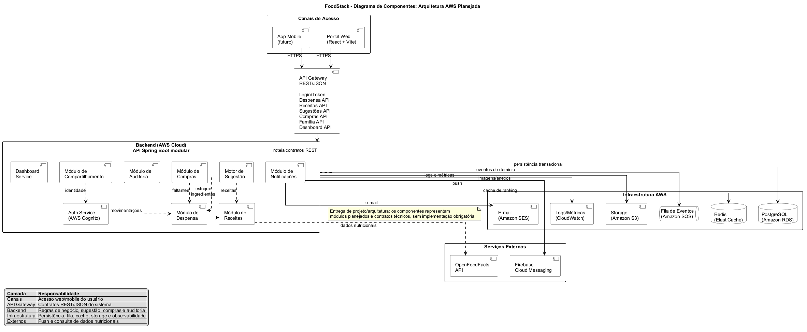
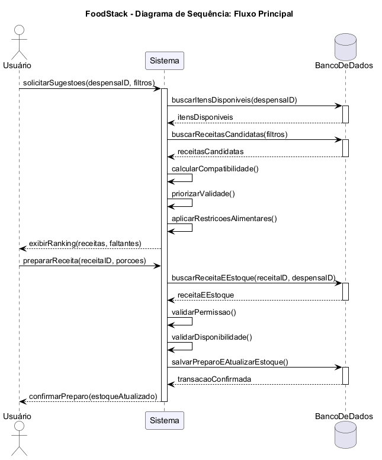
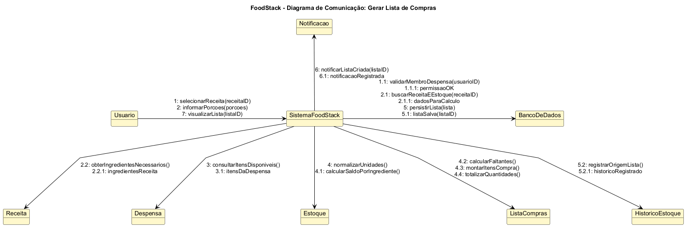
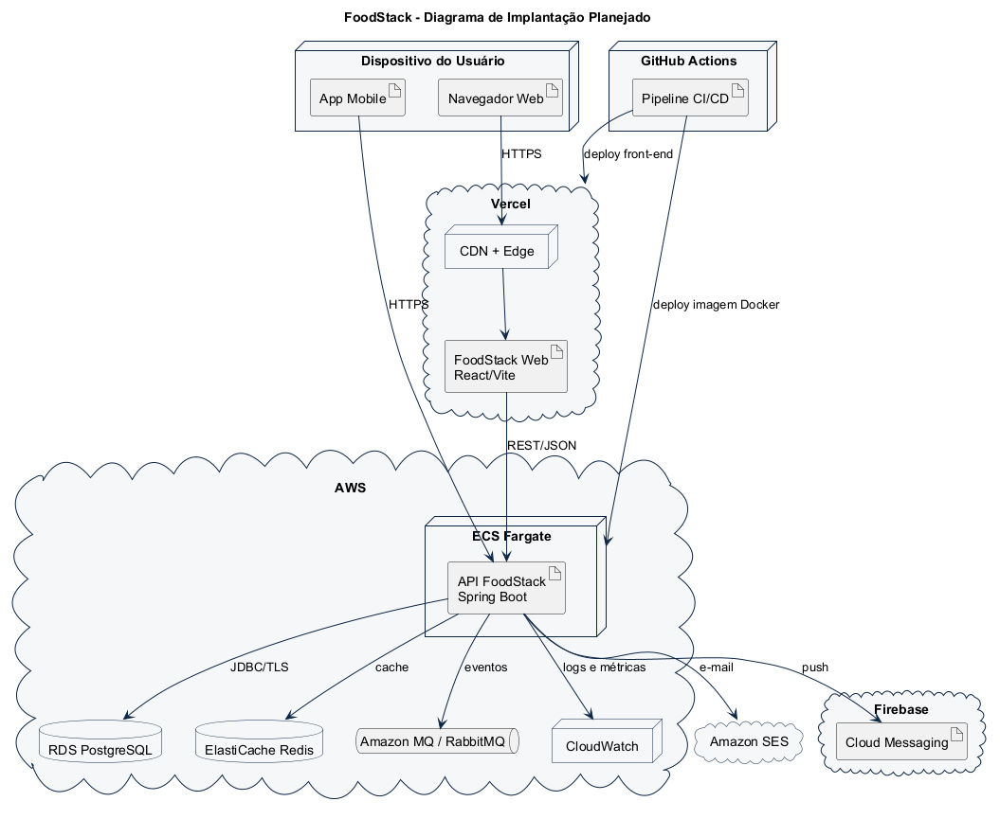

# 🍽️ FoodStack

<p align="center">
  
</p>

> **Despensa virtual e motor de recomendação de receitas** baseado em estoque doméstico, validade de alimentos, restrições alimentares e compartilhamento familiar.

<h2 align="center">➡️ <a href="#galeria-de-diagramas">VER GALERIA DE DIAGRAMAS UML</a> ⬅️</h2>

---

## 🧭 Atalhos principais

| Área | Link |
|---|---|
| 📌 Escopo da entrega | [Escopo](#-escopo-da-entrega) |
| 🧩 Resumo técnico | [Resumo técnico](#-resumo-técnico) |
| 🖼️ Visuais do projeto | [Problema x Solução](#problema-solucao) |
| ✅ Requisitos funcionais | [Requisitos funcionais](#-requisitos-funcionais) |
| 🛡️ Requisitos não funcionais | [Requisitos não funcionais](#️-requisitos-não-funcionais) |
| 📐 Regras de negócio | [Regras de negócio](#-regras-de-negócio) |
| 🔁 Contratos de operação | [Contratos de operação](#-contratos-de-operação) |
| 🏗️ Arquitetura | [Arquitetura de solução](#️-arquitetura-de-solução) |
| 🖼️ Diagramas renderizados | [Galeria de diagramas](#galeria-de-diagramas) |
| 🌱 Código PlantUML | [Arquivos PlantUML](#-arquivos-plantuml) |
| 🧭 Rastreabilidade | [Matriz de rastreabilidade](#-matriz-de-rastreabilidade) |

---

## 📌 Escopo da entrega

Este repositório contém o **projeto técnico e arquitetural** do FoodStack. A entrega não contém implementação de front-end, back-end, scripts de banco, containers executáveis ou deploy real. O objetivo é documentar a solução com rigor técnico e manter os diagramas em PlantUML.

| Exigência | Atendimento |
|---|---|
| Trabalho individual | Projeto identificado e documentado como entrega individual. |
| Uso obrigatório de PlantUML | Todos os diagramas foram escritos em `.puml`. |
| Código PlantUML no repositório | Arquivos em [`docs/plantuml`](docs/plantuml). |
| Não desenvolver código da aplicação | Não há implementação de sistema, apenas documentação e arquitetura. |
| Projeto, diagramação e arquitetura | Toda a especificação está consolidada neste README. |
| README no template solicitado | Inclui visão, funcionalidades, tecnologias, arquitetura, execução planejada, deploy, testes e referências. |

### 📎 Decisão de organização dos diagramas

Para evitar duplicidade e deixar a entrega mais objetiva, foi adotado o padrão:

> **1 diagrama por tipo.**

Assim, o projeto possui exatamente **9 diagramas UML/arquiteturais**:

| Tipo | Quantidade |
|---|---:|
| Casos de uso | 1 |
| Componentes | 1 |
| Classes | 1 |
| Modelo de dados / DER | 1 |
| Sequência | 1 |
| Atividade | 1 |
| Transição de Estados | 1 |
| Comunicação | 1 |
| Implantação | 1 |

---

<a id="problema-solucao"></a>

## 🖼️ Problema x Solução

<p align="center">
  
</p>

---

## 🧩 Resumo técnico

O FoodStack é uma aplicação planejada para organizar a despensa doméstica e recomendar receitas com base nos alimentos disponíveis. O sistema considera estoque, quantidade, unidade de medida, validade, local de armazenamento, restrições alimentares e permissões de compartilhamento.

### 🎯 Problema

Usuários frequentemente perdem alimentos por vencimento, compram itens duplicados por falta de visibilidade e têm dificuldade para decidir o que cozinhar com os ingredientes disponíveis.

### ✅ Solução

Uma despensa virtual compartilhável que:

- registra ingredientes e quantidades;
- acompanha validade dos alimentos;
- alerta itens próximos do vencimento;
- recomenda receitas compatíveis com o estoque;
- prioriza alimentos que precisam ser consumidos;
- baixa automaticamente o estoque após preparo;
- gera lista de compras com faltantes;
- permite colaboração entre membros da família.

<p align="center">
  
</p>

### 💼 Valor entregue

| Valor | Resultado esperado |
|---|---|
| Redução de desperdício | Alimentos próximos do vencimento são priorizados. |
| Melhor planejamento | Usuário sabe o que tem e o que falta comprar. |
| Decisão rápida | Sistema sugere receitas compatíveis. |
| Consistência operacional | Estoque é atualizado após preparo. |
| Colaboração | Despensa pode ser compartilhada com permissões. |

---

## ⚙️ Tecnologias planejadas

> As tecnologias abaixo são fictícias para uma futura implementação. Elas existem para documentar uma arquitetura realista e profissional.

| Camada | Tecnologias |
|---|---|
| Front-end | React 19, TypeScript 5.8, Vite 7, Tailwind CSS |
| Mobile futuro | React Native, Expo |
| Back-end | Java 21, Spring Boot 3.4, Spring Security, Spring Data JPA |
| API | REST, OpenAPI 3.1, DTOs, validação de contratos |
| Banco de dados | PostgreSQL 16, Flyway, Hibernate |
| Cache | Redis 7 |
| Eventos | RabbitMQ / Amazon SQS |
| Cloud | AWS ECS Fargate, AWS RDS, AWS S3, Amazon SES |
| Observabilidade | OpenTelemetry, Prometheus, Grafana, CloudWatch |
| Qualidade | JUnit, Mockito, Testcontainers, Playwright, ArchUnit |

---

## ✅ Requisitos funcionais

| ID | Requisito |
|---|---|
| RF-01 | Cadastrar ingrediente com nome, quantidade, unidade, validade opcional e local de armazenamento. |
| RF-02 | Editar quantidade, unidade, validade e local de um item da despensa. |
| RF-03 | Excluir item da despensa mediante confirmação. |
| RF-04 | Listar itens disponíveis com filtros por local, validade, categoria e status. |
| RF-05 | Classificar itens como disponíveis, próximos do vencimento, vencidos, consumidos ou removidos. |
| RF-06 | Notificar usuário sobre itens próximos do vencimento. |
| RF-07 | Sugerir receitas com base nos ingredientes disponíveis. |
| RF-08 | Calcular percentual de compatibilidade entre receita e estoque. |
| RF-09 | Priorizar receitas que utilizam itens próximos da validade. |
| RF-10 | Filtrar receitas por restrições alimentares. |
| RF-11 | Favoritar e desfavoritar receitas. |
| RF-12 | Registrar receita como preparada e baixar estoque automaticamente. |
| RF-13 | Gerar lista de compras com ingredientes ausentes ou insuficientes. |
| RF-14 | Cadastrar receitas próprias. |
| RF-15 | Compartilhar despensa com membros por convite. |
| RF-16 | Controlar permissões de dono, editor e leitor. |
| RF-17 | Registrar histórico de alterações de estoque. |
| RF-18 | Explicar recomendação com ingredientes usados, faltantes e priorizados. |

---

## 👤 Histórias de usuário

| ID | História |
|---|---|
| US-01 | Como usuário, eu quero adicionar novos ingredientes à minha despensa virtual informando nome e quantidade, para manter o controle do que tenho em casa. |
| US-02 | Como usuário, eu quero poder registrar a data de validade ao adicionar um ingrediente, para evitar o consumo de produtos estragados. |
| US-03 | Como usuário, eu quero receber notificações sobre ingredientes próximos da validade, para priorizar esses itens e evitar desperdício. |
| US-04 | Como usuário, eu quero visualizar uma lista completa dos itens disponíveis, para saber rapidamente o que tenho. |
| US-05 | Como usuário, eu quero classificar onde o ingrediente está guardado, para facilitar a localização física. |
| US-06 | Como usuário, eu quero alterar quantidade ou excluir ingrediente, para corrigir erros ou registrar descartes. |
| US-07 | Como usuário, eu quero sugestões de receitas usando ingredientes que já possuo, para decidir o que cozinhar. |
| US-08 | Como usuário, eu quero sugerir receitas com ingredientes prestes a vencer, para evitar perdas. |
| US-09 | Como usuário, eu quero que uma receita preparada subtraia automaticamente as quantidades utilizadas da despensa. |
| US-10 | Como usuário, eu quero filtrar receitas por restrições alimentares, para respeitar minha dieta. |
| US-11 | Como usuário, eu quero favoritar receitas, para encontrá-las facilmente no futuro. |
| US-12 | Como usuário, eu quero gerar lista de compras com ingredientes faltantes, para facilitar minha ida ao mercado. |
| US-13 | Como usuário, eu quero cadastrar minhas próprias receitas, para que elas apareçam nas sugestões. |
| US-14 | Como usuário, eu quero compartilhar a despensa com membros da família, para que todos mantenham o estoque sincronizado. |

---

## 🛡️ Requisitos não funcionais

| ID | Categoria | Requisito |
|---|---|---|
| RNF-01 | Segurança | Toda operação protegida deve validar autenticação e autorização no back-end. |
| RNF-02 | Segurança | Senhas devem ser armazenadas com hash forte e sal. |
| RNF-03 | Segurança | Tokens JWT devem possuir expiração e assinatura segura. |
| RNF-04 | Privacidade | Logs não devem registrar senha, token ou segredo. |
| RNF-05 | Performance | Consulta de estoque deve responder em até 500 ms para despensas comuns. |
| RNF-06 | Performance | Sugestão de receitas deve responder em até 2 s para catálogo inicial. |
| RNF-07 | Confiabilidade | Baixa automática de estoque deve ser transacional. |
| RNF-08 | Manutenibilidade | Domínio não deve depender diretamente da infraestrutura. |
| RNF-09 | Observabilidade | API deve expor logs estruturados, métricas e rastreamento. |
| RNF-10 | Testabilidade | Regras de negócio devem ser testáveis isoladamente. |

---

## 📐 Regras de negócio

| ID | Regra |
|---|---|
| RN-01 | Todo item deve possuir nome, quantidade positiva, unidade e local de armazenamento. |
| RN-02 | Validade é opcional, mas datas vencidas exigem confirmação explícita. |
| RN-03 | Item com validade em até 5 dias deve ser classificado como próximo do vencimento. |
| RN-04 | Item vencido não participa de sugestão sem aviso explícito ao usuário. |
| RN-05 | Itens com quantidade zero não aparecem como disponíveis. |
| RN-06 | Alterações de estoque registram usuário, data, operação e motivo quando aplicável. |
| RN-07 | Compatibilidade considera ingredientes obrigatórios disponíveis sobre obrigatórios totais. |
| RN-08 | Modo de vencimento adiciona peso para receitas com itens próximos da validade. |
| RN-09 | Receita filtrada por restrição alimentar não pode conter ingrediente incompatível. |
| RN-10 | Preparar receita exige estoque suficiente para todos os ingredientes obrigatórios. |
| RN-11 | Baixa automática ocorre em transação única. |
| RN-12 | Falha em qualquer item cancela toda a baixa. |
| RN-13 | Lista de compras contém apenas itens ausentes ou insuficientes. |
| RN-14 | Toda despensa possui exatamente um dono. |
| RN-15 | Convite de compartilhamento expira após 7 dias ou após aceite. |

---

## 🔐 Atores e permissões

| Perfil | Permissões |
|---|---|
| Dono | Consulta, cadastra, edita, remove, prepara receitas, convida membros, altera permissões e exclui despensa. |
| Editor | Consulta, cadastra, edita, remove itens e prepara receitas. |
| Leitor | Consulta estoque, receitas e listas, sem alterar dados. |
| Serviço de notificação | Envia alertas de validade. |
| Catálogo de receitas | Fornece receitas candidatas para recomendação. |

---

## 🧾 Casos de uso

| ID | Caso de uso |
|---|---|
| UC-01 | Cadastrar ingrediente |
| UC-02 | Registrar validade |
| UC-03 | Receber alerta de vencimento |
| UC-04 | Consultar estoque atual |
| UC-05 | Classificar armazenamento |
| UC-06 | Editar ou excluir ingrediente |
| UC-07 | Sugerir receitas por estoque |
| UC-08 | Priorizar itens próximos do vencimento |
| UC-09 | Marcar receita como preparada |
| UC-10 | Filtrar por restrição alimentar |
| UC-11 | Favoritar receita |
| UC-12 | Gerar lista de compras |
| UC-13 | Cadastrar receita própria |
| UC-14 | Compartilhar despensa |

---

## 🔁 Contratos de operação

| Contrato | Operação | Responsabilidade | Falhas esperadas |
|---|---|---|---|
| CO-01 | `cadastrarIngrediente(despensaId, item)` | Criar item de estoque. | Quantidade inválida, unidade inválida, acesso negado. |
| CO-02 | `consultarEstoque(despensaId, filtros)` | Retornar estoque filtrado. | Despensa inexistente, acesso negado. |
| CO-03 | `sugerirReceitas(despensaId, filtros)` | Gerar ranking de receitas. | Catálogo vazio, restrição inválida, despensa sem itens. |
| CO-04 | `prepararReceita(despensaId, receitaId, porcoes)` | Registrar preparo e baixar estoque. | Estoque insuficiente, conflito concorrente, acesso negado. |
| CO-05 | `gerarListaCompras(despensaId, receitaId)` | Calcular ingredientes faltantes. | Unidade incompatível, receita inexistente. |
| CO-06 | `convidarMembro(despensaId, email, papel)` | Criar convite de compartilhamento. | E-mail inválido, convite duplicado, papel inválido. |
| CO-07 | `cadastrarReceitaPropria(usuarioId, receita)` | Registrar receita do usuário. | Receita sem ingredientes ou sem modo de preparo. |

---

## 🏗️ Arquitetura de solução

O FoodStack foi projetado como um **monólito modular orientado a domínio**, separando interface, aplicação, domínio e infraestrutura.

<p align="center">
  
</p>

### Decisão arquitetural

| Decisão | Justificativa |
|---|---|
| Monólito modular | Reduz complexidade operacional sem perder organização interna. |
| PostgreSQL | Garante integridade para estoque, preparo, histórico e lista de compras. |
| Eventos internos | Desacoplam alertas e histórico das regras principais. |
| Redis planejado | Reduz custo de consultas repetidas no motor de sugestão. |
| JWT | Permite API stateless para web e mobile. |
| PlantUML versionado | Torna os diagramas auditáveis e reprodutíveis. |

### Camadas

| Camada | Responsabilidade |
|---|---|
| Interface | Web app e futuro app mobile. |
| API | Controllers REST, DTOs e validações de entrada. |
| Aplicação | Orquestra casos de uso, transações e autorização. |
| Domínio | Entidades, políticas, regras e invariantes. |
| Infraestrutura | Banco, cache, filas, e-mail, push e storage. |

---

## 🧬 Modelo de domínio

| Entidade | Papel |
|---|---|
| `Usuario` | Identidade autenticada. |
| `Despensa` | Agregado raiz do estoque doméstico. |
| `MembroDespensa` | Associação entre usuário, despensa e papel. |
| `ConviteCompartilhamento` | Convite com token, papel e expiração. |
| `Ingrediente` | Catálogo normalizado de ingredientes. |
| `ItemDespensa` | Ingrediente disponível com quantidade, unidade, validade e local. |
| `Receita` | Receita de catálogo ou própria. |
| `IngredienteReceita` | Composição de uma receita. |
| `ListaCompras` | Itens faltantes para preparar receita. |
| `Notificacao` | Alerta de validade ou evento relevante. |

---

## 🗄️ Modelo de dados

| Tabela | Finalidade |
|---|---|
| `usuarios` | Conta e identidade. |
| `despensas` | Despensas criadas. |
| `membros_despensa` | Papéis e permissões. |
| `convites_compartilhamento` | Convites pendentes, aceitos ou expirados. |
| `ingredientes` | Catálogo normalizado. |
| `itens_despensa` | Estoque disponível. |
| `historico_estoque` | Auditoria de movimentos. |
| `receitas` | Receitas públicas ou próprias. |
| `ingredientes_receita` | Ingredientes necessários por receita. |
| `restricoes_alimentares` | Restrições aplicáveis. |
| `favoritos_receita` | Receitas favoritas. |
| `listas_compras` | Listas geradas. |
| `itens_lista_compras` | Itens faltantes. |
| `notificacoes` | Alertas enviados. |

---

## 🔌 API planejada

| Método | Endpoint | Descrição |
|---|---|---|
| `POST` | `/api/auth/register` | Registra usuário. |
| `POST` | `/api/auth/login` | Autentica e retorna token. |
| `GET` | `/api/despensas/{id}/itens` | Lista estoque. |
| `POST` | `/api/despensas/{id}/itens` | Cadastra item. |
| `PUT` | `/api/despensas/{id}/itens/{itemId}` | Edita item. |
| `DELETE` | `/api/despensas/{id}/itens/{itemId}` | Remove item. |
| `GET` | `/api/despensas/{id}/sugestoes` | Sugere receitas. |
| `POST` | `/api/receitas/{id}/preparos` | Marca receita como preparada. |
| `POST` | `/api/despensas/{id}/listas-compras` | Gera lista de compras. |
| `POST` | `/api/despensas/{id}/convites` | Cria convite. |
| `POST` | `/api/convites/{token}/aceite` | Aceita convite. |

---

## 🧪 Estratégia de testes

| Tipo | Cobertura |
|---|---|
| Unidade | Regras de validade, compatibilidade, permissões e baixa. |
| Integração | Repositórios, transações e constraints. |
| Contrato | Endpoints, DTOs e códigos HTTP. |
| Arquitetura | Separação entre módulos e camadas. |
| E2E | Cadastro de item, sugestão, preparo e compartilhamento. |
| Documentação | Renderização dos arquivos PlantUML. |

---

## 🚀 Deploy planejado

| Camada | Tecnologia |
|---|---|
| Web | Vercel |
| API | AWS ECS Fargate |
| Imagens | AWS ECR |
| Banco | AWS RDS PostgreSQL |
| Cache | AWS ElastiCache Redis |
| Eventos | RabbitMQ / Amazon SQS |
| E-mail | Amazon SES |
| Push | Firebase Cloud Messaging |
| CI/CD | GitHub Actions |

---

## 🧭 Infográfico dos diagramas

<p align="center">
  
</p>

---

<a id="galeria-de-diagramas"></a>

## 🖼️ Galeria de diagramas UML

> Cada imagem abaixo foi gerada a partir do respectivo arquivo PlantUML. O repositório mantém **um diagrama por tipo**, sem duplicidade.

### 01 - Casos de uso

[Código PlantUML](docs/plantuml/01-casos-de-uso.puml)

<p align="center">
  
</p>

### 02 - Componentes

[Código PlantUML](docs/plantuml/02-diagrama-componentes.puml)

<p align="center">
  
</p>

### 03 - Classes

[Código PlantUML](docs/plantuml/03-diagrama-classes.puml)

<p align="center">
  
</p>

### 04 - Modelo de dados / DER

[Código PlantUML](docs/plantuml/04-modelo-dados-der.puml)

<p align="center">
  
</p>

### 05 - Sequência

[Código PlantUML](docs/plantuml/05-diagrama-sequencia.puml)

<p align="center">
  
</p>

### 06 - Atividade

[Código PlantUML](docs/plantuml/06-diagrama-atividade-alerta-vencimento.puml)

<p align="center">
  
</p>

### 07 - Transição de Estados

[Código PlantUML](docs/plantuml/07-diagrama-estados-item-despensa.puml)

<p align="center">
  
</p>

### 08 - Comunicação

[Código PlantUML](docs/plantuml/08-diagrama-comunicacao-lista-compras.puml)

<p align="center">
  
</p>

### 09 - Implantação

[Código PlantUML](docs/plantuml/09-diagrama-implantacao.puml)

<p align="center">
  
</p>

---

## 🌱 Arquivos PlantUML

| Arquivo | Tipo |
|---|---|
| [`01-casos-de-uso.puml`](docs/plantuml/01-casos-de-uso.puml) | Casos de uso |
| [`02-diagrama-componentes.puml`](docs/plantuml/02-diagrama-componentes.puml) | Componentes |
| [`03-diagrama-classes.puml`](docs/plantuml/03-diagrama-classes.puml) | Classes |
| [`04-modelo-dados-der.puml`](docs/plantuml/04-modelo-dados-der.puml) | Modelo de dados |
| [`05-diagrama-sequencia.puml`](docs/plantuml/05-diagrama-sequencia.puml) | Sequência |
| [`06-diagrama-atividade-alerta-vencimento.puml`](docs/plantuml/06-diagrama-atividade-alerta-vencimento.puml) | Atividade |
| [`07-diagrama-estados-item-despensa.puml`](docs/plantuml/07-diagrama-estados-item-despensa.puml) | Transição de Estados |
| [`08-diagrama-comunicacao-lista-compras.puml`](docs/plantuml/08-diagrama-comunicacao-lista-compras.puml) | Comunicação |
| [`09-diagrama-implantacao.puml`](docs/plantuml/09-diagrama-implantacao.puml) | Implantação |

### Renderização local

```bash
java -jar plantuml.jar -tpng docs/plantuml/*.puml -o ../diagramas
```

---

## 🧭 Matriz de rastreabilidade

| História | RF | RN | Caso de uso | Diagrama |
|---|---|---|---|---|
| US-01 | RF-01 | RN-01 | UC-01 | 01, 03 |
| US-02 | RF-01, RF-05 | RN-02, RN-03 | UC-02 | 01, 07 |
| US-03 | RF-05, RF-06 | RN-03 | UC-03 | 06 |
| US-04 | RF-04 | RN-05 | UC-04 | 01, 04 |
| US-05 | RF-01, RF-02 | RN-01 | UC-05 | 03 |
| US-06 | RF-02, RF-03 | RN-06 | UC-06 | 03, 07 |
| US-07 | RF-07, RF-08 | RN-07 | UC-07 | 05 |
| US-08 | RF-09 | RN-08 | UC-08 | 05, 06 |
| US-09 | RF-12, RF-17 | RN-10, RN-11 | UC-09 | 05, 07 |
| US-10 | RF-10 | RN-09 | UC-10 | 05 |
| US-11 | RF-11 | - | UC-11 | 03 |
| US-12 | RF-13 | RN-13 | UC-12 | 08 |
| US-13 | RF-14 | - | UC-13 | 03, 04 |
| US-14 | RF-15, RF-16 | RN-14, RN-15 | UC-14 | 01, 02 |

---

## 📁 Estrutura do repositório

```text
foodstack/
├── README.md
├── LICENSE
├── .gitignore
├── assets/
│   ├── logo-foodstack.svg
│   ├── logo-foodstack.png
│   └── readme/
│       ├── banner_topo_logo_foodstack.png
│       ├── problema_solucao.png
│       ├── visao_geral_solucao.png
│       ├── mapa_modulos.png
│       ├── todos_diagramas.png
│       └── final_encerramento.png
└── docs/
    ├── diagramas/
    │   ├── 01-casos-de-uso.png
    │   ├── 02-diagrama-componentes.png
    │   ├── 03-diagrama-classes.png
    │   ├── 04-modelo-dados-der.png
    │   ├── 05-diagrama-sequencia.png
    │   ├── 06-diagrama-atividade-alerta-vencimento.png
    │   ├── 07-diagrama-estados-item-despensa.png
    │   ├── 08-diagrama-comunicacao-lista-compras.png
    │   └── 09-diagrama-implantacao.png
    └── plantuml/
        ├── 01-casos-de-uso.puml
        ├── 02-diagrama-componentes.puml
        ├── 03-diagrama-classes.puml
        ├── 04-modelo-dados-der.puml
        ├── 05-diagrama-sequencia.puml
        ├── 06-diagrama-atividade-alerta-vencimento.puml
        ├── 07-diagrama-estados-item-despensa.puml
        ├── 08-diagrama-comunicacao-lista-compras.puml
        └── 09-diagrama-implantacao.puml
```

---

## ✅ Validação da entrega

| Verificação | Resultado |
|---|---|
| README único com especificação completa | OK |
| Um diagrama por tipo | OK |
| 9 arquivos `.puml` versionados | OK |
| 9 imagens `.png` renderizadas no README | OK |
| 6 imagens visuais de apoio no README | OK |
| PlantUML renderiza sem erro de sintaxe | OK |
| Código de aplicação ausente | OK |
| Requisitos, regras, contratos, arquitetura e rastreabilidade documentados | OK |

---

## 📖 Referências

- Template README solicitado: https://github.com/joaopauloaramuni/laboratorio-de-desenvolvimento-de-software/blob/main/TEMPLATES/template_README.md
- PlantUML: https://plantuml.com/
- C4 Model: https://c4model.com/
- Spring Boot: https://spring.io/projects/spring-boot
- React: https://react.dev/
- PostgreSQL: https://www.postgresql.org/docs/
- Docker: https://docs.docker.com/

---

## 👤 Autor

| Campo | Informação |
|---|---|
| Projeto | FoodStack |
| Tema | Despensa virtual e gerador inteligente de receitas |
| Tipo | Projeto técnico, documentação, arquitetura e diagramas |
| Entrega | README único + PlantUML + imagens renderizadas |
| Versão | 1.0.0 |
| Data | 07/06/2026 |

---

## 🏁 Encerramento

<p align="center">
  
</p>

---

## 📜 Licença

Distribuído sob licença MIT. Consulte [`LICENSE`](LICENSE).
